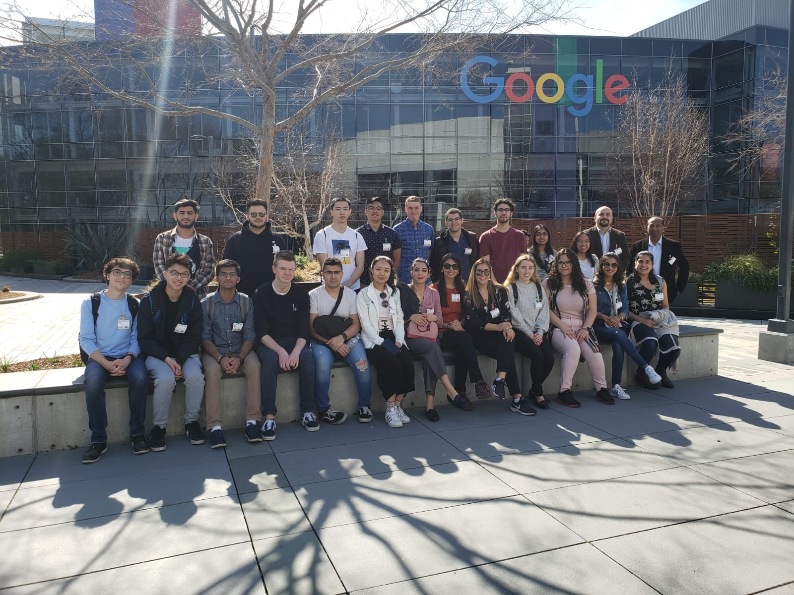
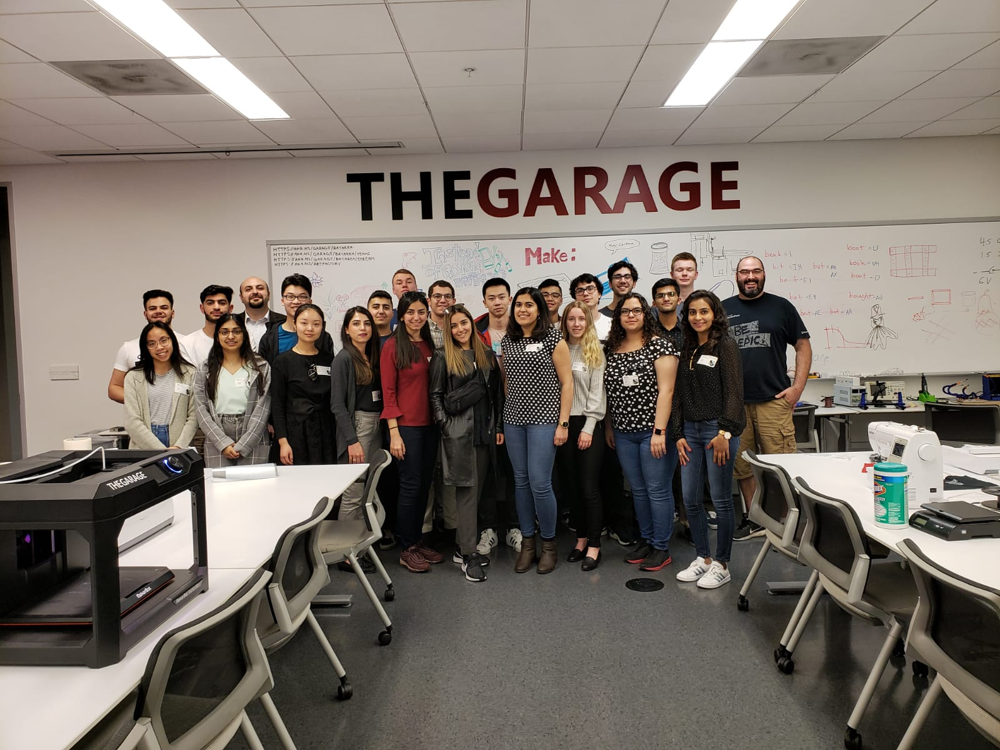

I got the pleasure of flying out to the Bay Area over the span of reading week this semester, where I got the chance to talk to some amazingly bright minds at some great companies. I got to check out the insane innovation that takes place within Microsoft Garage, the crazy amounts of moving parts inside the Tesla factory, and the massive office complex that is the Googleplex.

For me, I really enjoyed hearing the stories from the engineers detailing the diverse paths they took to get to where they are now. The University of Calgary isn’t exactly a top-tier tech school; as a student, it’s quite easy to believe that huge companies like these are out of reach from someone who doesn’t go to a Stanford or a Waterloo. But the UCalgary alumni gave me the reminder I needed that it **is** possible if you put the work in and really apply yourself. That one day, if you worked hard enough, you could get a sweet offer at a great tech company in the Bay Area.

But why is that such a big dream? Why are so many young Calgarian software developers so allured by tech companies elsewhere? In fact, the only demographic that’s experienced a population decline is young adults from 20-24, which is around the age of when most university students graduate and move on to the workforce.

The fact is, young adults in every sector are not seeing Calgary as an attractive place to start their careers. Calgary is both failing to keep its talent here and to bring in new talent from elsewhere.

What is it about Calgary's industries that pales in comparison to industries elsewhere? After spending a week in the illustrious and enchanting Silicon Valley and interacting with the bright minds down there, I think I have a better idea of why young adults so desperately want to leave Calgary, and what Calgary can do as a whole to make the city a better destination for aspiring software developers.

## Transition away from Calgary’s oil and gas identity and embrace technology

Cruising down the San Francisco highway, from the airport to our first hotel, the first thing that caught our eye was a billboard. “Can your Work OS automate workflows?”, it read in big bold text - it was for monday.com, a company building a work OS for custom workflow apps in a code-free environment. Tech-related ads lined the US-101 all the way down to our hotel in Santa Clara. Billboards like this only work in Silicon Valley, where tech is embraced like poutine in Quebec.

Technology is overshadowed by the energy industry in Calgary, a city that breathes oil and gas. The sign visitors see when they enter the city boldly reads “be a part of the energy”. Calgary’s downtown is home to many huge oil and gas players, including CNRL, Cenovus, Imperial Oil, Suncor Energy - the list goes on. Unsurprisingly, young adults generally don’t like working in oil and gas for various reasons. The ever-growing support for climate change initiatives. The dependence of the oil and gas industry on global prices. The allure of the younger, more modern work cultures of tech companies.

We should continue to support our tech community through tech-related events and programs, and support ideas that would make Calgary more welcoming to tech companies, such as the TwinHills cyber-city. Calgary’s been referred to as the potential Silicon Valley of the North before, and it’s time to transform our identity to live up to that potential.

## Increase software engineering salaries in Calgary

We have to be honest with ourselves - Calgary’s intern and new grad salaries are not where they need to be to compete with companies from other cities. This is painfully obvious once you compare the software/computer science co-op/intern wages between Canadian tech schools:

| UCalgary   | Waterloo   | U of T     | UBC        |
| ---------- | ---------- | ---------- | ---------- |
| \$21.90/hr | \$25.65/hr | \$27.22/hr | \$24.12/hr |

I truly believe that the intern salaries that Calgary tech companies are offering are not accurately reflecting the value an intern can bring. You’d be surprised with how many amazingly smart individuals I’m surrounded by at the University of Calgary. One student accompanying me on the trip founded his very own club, Relectric, where he and his team are building a freaking electric-car! These are the students that have the potential to provide deep, long-lasting impacts on companies, and these are the students leaving Calgary for higher paying jobs that better reflect their value.

Silicon Valley companies know this. Facebook pays its interns $8000 USD a month, which works out to $61.18/hr. They know the value that an outstanding student can bring, and demonstrate this in their internship salaries. It’s time for Calgary companies to adopt the same mindset.

## Continue to support and expand innovation through events and programs

In order to bolster the tech sector in Calgary, companies need to work together with the city and province to provide the resources needed for startups. Calgary has already done a great job with supporting innovation through various funding options, like the Accelerate Fund and the Sprout Fund. Startup accelerators have helped many tech companies turn into household names - Y Combinator, a Silicon Valley seed accelerator, has backed companies like Stripe, Airbnb, Dropbox, and Twitch. Seeing funds similar to this in Alberta definitely gives me hope for the future of the tech industry here in Calgary.

However, there are areas where we can find improvement. Alberta’s new provincial budget eliminated five tax credits, of which include the Alberta Investor Tax Credit (AITC) and Capital Investment Tax Credit. Calgary’s tech sector definitely enjoyed the support from these tax credits and will be sad to see them gone. I’d like to see the provincial government reintroduce policies that support and encourage innovation and growth in the technology field.

## Conclusion

Being a Calgarian all my life, I've lived through both the 2008 and 2015 recessions and have seen the implications it's had on the local community. Alberta has always talked about diversifying its economy and reducing its dependency on the oil industry, and I think that there's a lot of potential to do that through technology.

A famous saying at the University of Waterloo is "Cali or bust". I know it might sound far-fetched, but maybe one day, if we play the right cards, we'll be hearing "Calgary or bust" a lot more too.
